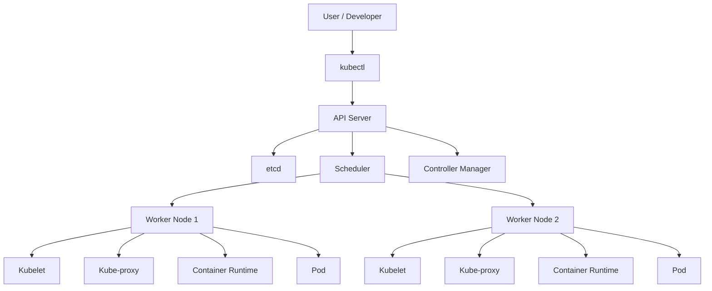

# Kubernetes Architecture

This guide explains Kubernetes architecture in a simple and practical way. It is written for learners who want to understand not only what the components are, but also how Kubernetes actually works and how communication happens inside a cluster.

---

## 1. What is Kubernetes Architecture?

Kubernetes architecture is the design of a Kubernetes cluster. A cluster is a group of machines that work together to run containerized applications.

At a high level, Kubernetes has two main parts:
- the control plane
- worker nodes

The control plane decides what should happen.
The worker nodes actually run the applications.

---

## 2. High-Level View of Kubernetes

Think of Kubernetes like a smart operating system for your applications.

- The control plane is the brain.
- The worker nodes are the hands.
- Pods are the small units of work.
- Services help applications communicate with each other.

### Simple analogy
- Control plane = manager/leader
- Worker nodes = employees
- Pods = tasks assigned to employees
- Service = phone number or address that helps others reach the right task

---

## 3. Kubernetes Components

A Kubernetes cluster contains the following major components:

### A. Control Plane Components
These components manage the cluster.

1. API Server
   - The API server is the front door of Kubernetes.
   - All requests from kubectl, dashboards, and other tools go through it.
   - It validates requests and updates the cluster state.

2. etcd
   - etcd is the cluster's database.
   - It stores the desired state and current state of the cluster.
   - It is like the memory of Kubernetes.

3. Scheduler
   - The scheduler decides which node should run a new pod.
   - It checks available resources and places the pod intelligently.

4. Controller Manager
   - It runs controllers that watch the cluster and make sure the desired state is achieved.
   - Example: if a pod dies, the controller manager helps recreate it.

5. Cloud Controller Manager
   - This is used when Kubernetes runs on a cloud provider.
   - It manages cloud-specific resources like load balancers and storage.

### B. Worker Node Components
These components run the applications.

1. Kubelet
   - Kubelet runs on each node.
   - It receives instructions from the control plane.
   - It ensures containers in pods are running correctly.

2. Kube Proxy
   - Kube-proxy handles networking on each node.
   - It helps services route traffic to the correct pods.

3. Container Runtime
   - This is the engine that runs containers.
   - Common runtimes are containerd and CRI-O.

---

## 4. Visual Architecture Diagram



---

## 5. What is a Pod?

A pod is the smallest deployable unit in Kubernetes.

A pod usually contains:
- one or more containers
- shared storage
- shared network

### Why pods are important
Pods are the basic unit on which Kubernetes schedules and manages applications.

### Example
If you deploy a web application, Kubernetes may create a pod that contains:
- one container running the app
- one sidecar container for logging or monitoring

---

## 6. What is a Node?

A node is a worker machine in the cluster.

Each node can run one or more pods.

A node typically has:
- CPU and memory
- kubelet
- kube-proxy
- container runtime

A Kubernetes cluster usually has multiple nodes for reliability and scaling.

---

## 7. What is a Deployment?

A Deployment tells Kubernetes how to run an application.

It defines things like:
- how many replicas to run
- which image to use
- how to update the application

Example idea:
- If you want 3 copies of your app running, you define 3 replicas.
- Kubernetes will make sure 3 pods exist.

---

## 8. What is a Service?

A Service provides a stable way to access pods.

Pods are temporary. They can be restarted or replaced. Because of that, pods can change their IP addresses.

A Service gives your application a stable network identity.

### Why a Service is needed
Without a Service, clients would need to know the current pod IP, which is not reliable.

### Example
If you have 3 replicas of a web app, a Service can expose them through one stable endpoint.

---

## 9. How Kubernetes Works in Real Life

Here is the step-by-step process:

1. A developer creates a deployment definition.
2. The developer applies it using kubectl.
3. The API server receives the request.
4. The request is stored in etcd.
5. The scheduler finds a suitable node.
6. The controller manager ensures the desired number of pods exists.
7. The kubelet on the chosen node starts the pod.
8. The container runtime runs the container inside the pod.
9. The Service exposes the app to users or other services.

This is how Kubernetes transforms a simple configuration into running application instances.

---

## 10. Communication Flow Inside Kubernetes

Understanding communication flow is very important for beginners.

### A. User to Kubernetes Cluster

When a user runs a command like:

```bash
kubectl apply -f deployment.yaml
```

The flow is:
1. kubectl sends the request to the API server
2. API server validates the request
3. The request is stored in etcd
4. Controllers and scheduler act on the request
5. Pods are created on worker nodes

### B. Control Plane to Worker Nodes

The control plane communicates with worker nodes through the kubelet.

- The API server sends instructions
- The kubelet receives those instructions
- The kubelet starts, stops, or monitors containers

### C. Pod to Pod Communication

Pods can communicate with each other using the cluster network.

Each pod usually gets its own IP address.

This allows services to talk to each other without worrying about the underlying node.

### D. Service to Pod Communication

When a request comes to a Service:
1. The Service selects matching pods
2. kube-proxy routes traffic to one of the pods
3. The request reaches the target container

This is how Kubernetes provides stable access even when pods are replaced.

---

## 11. Request Flow Example

Let us understand a simple example:

You deploy a web application using a Deployment and a Service.

### Step 1: Create deployment
You tell Kubernetes:
- run 3 replicas of the app
- use a specific image

### Step 2: Kubernetes creates pods
The scheduler chooses nodes.
The kubelet on the node starts the containers.

### Step 3: Create a Service
The Service exposes the application on a stable IP or DNS name.

### Step 4: User sends a request
A user or another service sends a request to the Service.

### Step 5: Traffic is routed
The Service forwards traffic to one of the matching pods.

### Step 6: Pod responds
The application inside the pod handles the request and sends a response back.

---

## 12. Why Kubernetes Needs Control Plane and Worker Nodes

The architecture is split into two layers because Kubernetes manages applications at scale.

- The control plane makes decisions.
- The worker nodes execute those decisions.

This separation makes the system:
- scalable
- self-healing
- predictable
- easier to manage

---

## 13. Important Concepts Related to Architecture

### ReplicaSet
A ReplicaSet ensures the desired number of pod replicas are running.

### StatefulSet
Used for applications that need stable identities or persistent storage.

### DaemonSet
Runs one pod on each node.

### Job and CronJob
Used for batch workloads and scheduled tasks.

### Ingress
Ingress manages external access to services, especially HTTP and HTTPS traffic.

### ConfigMap and Secret
These are used to provide configuration and sensitive information to applications.

---

## 14. How Kubernetes Achieves High Availability

Kubernetes improves reliability by:
- running multiple replicas of an application
- restarting failed containers
- rescheduling pods when nodes fail
- distributing traffic across pods

This is one of the main reasons Kubernetes is so popular in production environments.

---

## 15. Simple Real-World Example

Imagine a company has an online shopping website.

If many users visit the site:
- Kubernetes can create more copies of the web application
- traffic can be balanced across those copies
- if one pod fails, another pod can take over

This makes the website more reliable and scalable.

---

## 16. Why Learners Should Understand Architecture

When you understand Kubernetes architecture, you can better understand:
- why pods are used
- why Services are needed
- how scaling works
- how updates happen safely
- why failures are handled automatically

This knowledge is very useful for interviews, real projects, and DevOps work.

---

## 17. Summary

Kubernetes architecture is built around a simple idea:
- the control plane manages the cluster
- worker nodes run the applications
- pods are the basic units of work
- Services provide stable access to those pods

The architecture helps Kubernetes automatically deploy, scale, heal, and manage applications.

---

## 18. Quick Revision Points

- Kubernetes has a control plane and worker nodes.
- The API server is the central entry point.
- etcd stores cluster state.
- The scheduler chooses where pods should run.
- The controller manager maintains desired state.
- kubelet runs on each node and manages pods.
- kube-proxy helps with networking.
- Pods are the basic units of execution.
- Services provide stable network access to pods.

---

## 19. Final Thoughts

If you want to master Kubernetes, start by understanding its architecture first.

Focus on these questions:
1. What does the control plane do?
2. What does a worker node do?
3. How does a Service reach a Pod?
4. What happens when a pod fails?

Once these basics are clear, advanced concepts like ingress, storage, Helm, and autoscaling become much easier to learn.
